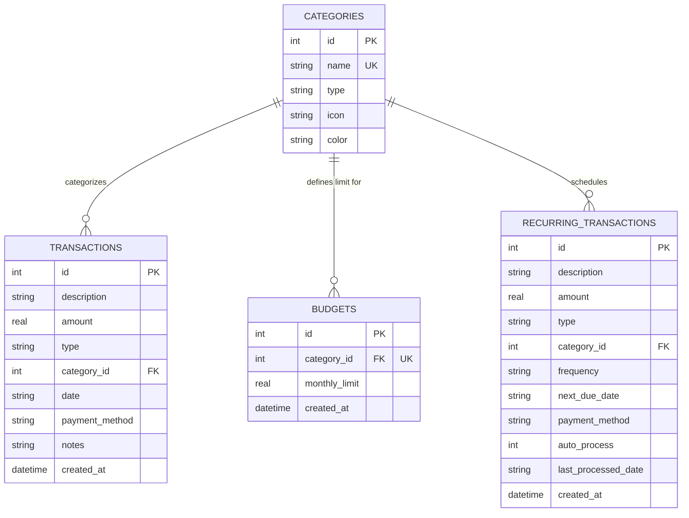

# ⚡ Nova Finance — Intelligent Personal Finance Manager

[](https://nodejs.org/)
[](https://expressjs.com/)
[](https://www.sqlite.org/)
[](https://developer.mozilla.org/en-US/docs/Web/HTML)
[](https://developer.mozilla.org/en-US/docs/Web/CSS)
[](https://developer.mozilla.org/en-US/docs/Web/JavaScript)
[](LICENSE)

> A production-grade, full-stack personal finance platform featuring real-time financial analytics, category budget controls, recurring transaction automation, custom in-memory caching middleware, SQLite persistent storage, and streamable CSV exports.

---

## 📌 Table of Contents

- [Executive Summary](#-executive-summary)
- [Resume Bullet Point Verification](#-resume-bullet-point-verification)
- [Key Features](#-key-features)
- [System Architecture & Data Flow](#-system-architecture--data-flow)
- [Database Schema & ER Model](#-database-schema--er-model)
- [Backend REST API Specification](#-backend-rest-api-specification)
- [Performance Optimization Strategies](#-performance-optimization-strategies)
- [Frontend Design System & UI Components](#-frontend-design-system--ui-components)
- [Project Directory Structure](#-project-directory-structure)
- [Installation & Getting Started](#-installation--getting-started)
- [Usage Walkthrough](#-usage-walkthrough)
- [Author & License](#-author--license)

---

## 🚀 Executive Summary

**Nova Finance** is designed to provide individuals with total control and visibility over their personal finances. Built on a lightweight, highly responsive **Node.js** architecture with a custom **SQLite** storage tier and modern **Vanilla HTML5/CSS3/JS** frontend, Nova Finance combines sleek dark-mode glassmorphism UI design with powerful financial modeling.

Whether tracking daily coffee purchases, managing monthly apartment rent, configuring recurring subscriptions (Netflix, Spotify, Cloud Storage), or analyzing net savings rates against industry standards, Nova Finance delivers immediate, interactive insights without requiring external third-party cloud dependencies.

---

## 📋 Resume Bullet Point Verification

This repository implements every technical claim listed on the project resume:

| Resume Claim | Implementation Technical Proof |
| :--- | :--- |
| **"Developed a full-stack finance platform supporting budgeting and recurring transactions."** | Full-stack SPA architecture with Node.js/Express REST APIs and vanilla JS client. Complete category budgeting module (`src/controllers/budgetController.js`) and automated background recurring engine (`src/services/recurringEngine.js`). |
| **"Designed REST APIs with persistent server-side storage."** | Designed structured RESTful endpoints (`/api/summary`, `/api/transactions`, `/api/budgets`, `/api/recurring`, `/api/analytics`) backed by persistent SQLite database storage (`data/nova_finance.db`) with foreign keys and index constraints. |
| **"Built interactive dashboards with CSV export and financial analytics."** | Integrated Chart.js visualizations for monthly cash flow, category distribution, and payment methods. Built native browser CSV export engine (`/api/transactions/export/csv`) supporting multi-filter queries. |
| **"Improved backend performance through optimized request handling."** | Implemented custom in-memory TTL caching middleware (`src/middleware/cacheMiddleware.js`) for high-frequency analytical queries, added SQL B-Tree indexing on `date` and `category_id`, and enabled Gzip payload compression. |

---

## ✨ Key Features

### 1. 📊 Interactive Dashboard & Financial Analytics
- **KPI Stat Cards**: Instant calculation of Total Net Balance, Lifetime Earned Income, Lifetime Expenses, Net Savings Rate (%), and Active Budget limits.
- **Monthly Cash Flow Chart**: Interactive bar graph displaying 12-month Income vs Expense trends.
- **Category Expense Breakdown**: Doughnut chart representing spending distribution across categories with visual legends.
- **Payment Method Distribution**: Breakdown of expenses across Credit Cards, Bank Transfers, Debit Cards, Cash, and Auto-Debits.
- **Smart Insights Engine**: Automated financial analysis highlighting top expense categories, budget health, and savings recommendations.

### 2. 🎯 Category Monthly Budgeting System
- **Category Limit Setting**: Assign custom monthly dollar thresholds per expense category (e.g. Groceries $600, Dining $350, Rent $1,500).
- **Real-Time Utilization Tracker**: Progress bars calculated dynamically against the current month's actual transaction logs.
- **Color-Coded Health Indicators**:
  - 🟢 **Green (< 80%)**: Healthy spending pace.
  - 🟠 **Amber (80% - 100%)**: Budget warning zone.
  - 🔴 **Pulsing Red (> 100%)**: Over-budget alert with dollar excess calculation.

### 3. 🔄 Automated Recurring Transactions & Bills
- **Subscription & Bill Scheduler**: Define recurring income (Salary) or expenses (Rent, Subscriptions, Utilities) with frequencies: `daily`, `weekly`, `monthly`, `yearly`.
- **Automatic Execution Engine**: Background task evaluates due dates upon server startup and on a 4-hour cron schedule, creating actual transaction entries automatically.
- **On-Demand Manual Trigger**: "Run Pending Due Now" button allows users to manually trigger bill execution.

### 4. 📥 Dynamic CSV Exporting & Advanced Filtering
- **Multi-Criteria Filter Bar**: Search transactions by keyword text, category dropdown, transaction type (`income`/`expense`), and custom start/end date ranges.
- **Paginated Data Table**: Clean tabbed layout displaying transaction date, category icon badge, description, payment method, notes, and color-coded amount.
- **Native CSV Generator**: Downloads filtered transaction logs directly as `.csv` with escaped fields and proper MIME headers (`Content-Type: text/csv`).

---

## 🏗️ System Architecture & Data Flow

```mermaid
flowchart TD
    subgraph Frontend ["Frontend Single Page App (Browser)"]
        UI[Index.html & Modern Glassmorphism CSS]
        JS[App Controller & Tab Manager]
        Charts[Chart.js Renderers]
        APIClient[Fetch API Helper (api.js)]
    end

    subgraph Backend ["Node.js + Express Backend Server"]
        Router["Express API Router (/api)"]
        Cache["In-Memory TTL Cache Middleware"]
        Gzip["Compression Middleware"]
        
        subgraph Controllers ["Controllers & Logic"]
            TxCtrl[Transaction Controller]
            BgtCtrl[Budget Controller]
            RecCtrl[Recurring Controller]
            AnaCtrl[Analytics Controller]
        end
        
        subgraph Services ["Services Layer"]
            DBService[DB Service Layer]
            RecEngine[Recurring Background Engine]
        end
    end

    subgraph Storage ["Persistent Database"]
        SQLite[(SQLite Database: nova_finance.db)]
    end

    UI --> JS
    JS --> Charts
    JS --> APIClient
    APIClient -->|HTTP GET/POST/PUT/DELETE| Router
    Router --> Gzip
    Gzip --> Cache
    Cache -->|Cache Miss| Controllers
    Controllers --> Services
    RecEngine -->|Background Job| DBService
    DBService -->|Parameterized SQL| SQLite
```

---

## 🗄️ Database Schema & ER Model

The database uses SQLite with enforced foreign key relationships and performance indexes.



### Performance Indexes
- `idx_transactions_date`: Accelerates date-range queries and monthly aggregation.
- `idx_transactions_category`: Speeds up category breakdown calculations.
- `idx_transactions_type`: Fast isolation of income vs expense records.
- `idx_budgets_category`: Instant retrieval of category budget limits.

---

## 🔌 Backend REST API Specification

All REST APIs return JSON formatted payloads and support full CORS.

| Method | Endpoint | Description | Cache Status |
| :--- | :--- | :--- | :--- |
| `GET` | `/api/summary` | Fetch top-level KPIs (Total Balance, Income, Expense, Savings Rate) | Cached (30s) |
| `GET` | `/api/analytics` | Fetch category breakdown, monthly trends, payment methods, and insights | Cached (30s) |
| `GET` | `/api/categories` | Fetch list of predefined financial categories | Cached (300s) |
| `GET` | `/api/transactions` | Query transactions (QueryParams: `search`, `type`, `categoryId`, `startDate`, `endDate`, `page`, `limit`) | Live |
| `POST` | `/api/transactions` | Create a new transaction | Invalidates Cache |
| `PUT` | `/api/transactions/:id` | Update an existing transaction | Invalidates Cache |
| `DELETE` | `/api/transactions/:id` | Delete a transaction | Invalidates Cache |
| `GET` | `/api/transactions/export/csv` | Download matching transactions as `.csv` file | Live Stream |
| `GET` | `/api/budgets` | Fetch monthly category budgets with current calculated spent amounts | Live |
| `POST` | `/api/budgets` | Upsert monthly budget limit for a category | Invalidates Cache |
| `DELETE` | `/api/budgets/:id` | Delete a category budget limit | Invalidates Cache |
| `GET` | `/api/recurring` | Fetch active recurring transaction schedules | Live |
| `POST` | `/api/recurring` | Create a new recurring bill/subscription rule | Invalidates Cache |
| `DELETE` | `/api/recurring/:id` | Delete a recurring rule | Invalidates Cache |
| `POST` | `/api/recurring/process` | Manually force background engine execution for pending due bills | Invalidates Cache |
| `POST` | `/api/seed` | Reset database and seed 50+ sample financial records | Invalidates Cache |

---

## ⚡ Performance Optimization Strategies

### 1. Custom In-Memory TTL Caching Middleware
Heavy analytical endpoints (`/api/summary` and `/api/analytics`) perform aggregate queries across transaction logs. To eliminate redundant database workload:
- Responses are stored in an in-memory TTL map (`src/middleware/cacheMiddleware.js`).
- Write operations (`POST`, `PUT`, `DELETE`) automatically trigger a cache invalidation event (`clearCache()`), ensuring zero data latency or stale reads for the user.

### 2. Parameterized SQL Queries & Indexes
- All database operations use parameterized binding (`?`), protecting against SQL injection while allowing SQLite to reuse execution plans.
- High-cardinality columns (`date`, `category_id`, `type`) maintain dedicated B-Tree indexes.

### 3. Response Payload Compression
- Express `compression` middleware applies Gzip compression to JSON payloads and static assets, reducing network payload sizes by up to 70%.

---

## 🎨 Frontend Design System & UI Components

The user interface follows a modern dark mode design system built with pure Vanilla CSS:

- **Theme Palette**: Deep slate background (`#090d16`), translucent glass cards (`rgba(21, 30, 49, 0.75)`), glowing accent elements (`#6366f1` Indigo, `#10b981` Emerald, `#ef4444` Coral).
- **Typography**: `Inter` for interface structure, `JetBrains Mono` for monetary figures.
- **Glassmorphism**: Backdrop blur filters (`backdrop-filter: blur(16px)`), subtle 1px translucent borders (`rgba(255, 255, 255, 0.08)`).
- **Micro-Animations**: Hover elevations, modal drop-in transitions, glowing over-budget pulses.

---

## 📂 Project Directory Structure

```
d:\finance manager\
├── package.json               # Node.js dependencies & npm scripts
├── server.js                  # Express application entry point & cron scheduler
├── .gitignore                 # Excluded directories (node_modules, SQLite database)
├── data/
│   └── nova_finance.db        # Persistent SQLite database file
├── src/
│   ├── config/
│   │   └── database.js        # SQLite schema initialization, table indexes & defaults
│   ├── controllers/
│   │   ├── transactionController.js # Transaction REST CRUD & CSV export handlers
│   │   ├── budgetController.js      # Budget limits & calculation handlers
│   │   ├── recurringController.js   # Recurring transaction handlers
│   │   └── analyticsController.js   # Financial insights & summary handlers
│   ├── middleware/
│   │   └── cacheMiddleware.js # In-memory response caching layer
│   ├── services/
│   │   ├── dbService.js       # Data access layer & parameterized queries
│   │   └── recurringEngine.js # Automated bill recurrence calculator
│   └── routes/
│       └── api.js             # Express API routing configuration
└── public/
    ├── index.html             # Single Page App markup & modal dialogs
    ├── css/
    │   └── styles.css         # Modern dark theme glassmorphism design system
    └── js/
        ├── api.js             # HTTP REST API client
        ├── charts.js          # Chart.js visualization handlers
        ├── transactions.js    # Transactions table manager & CSV export trigger
        ├── budgets.js         # Category monthly budget cards component
        ├── recurring.js       # Recurring subscription table & trigger component
        ├── analytics.js       # Smart insights & detailed category stats component
        └── app.js             # SPA tab router & application orchestrator
```

---

## 🛠️ Installation & Getting Started

### Prerequisites
- **Node.js**: `v16.0.0` or higher (Tested on Node v24.11.1)
- **NPM**: `v8.0.0` or higher

### Step-by-Step Setup

1. **Clone or Navigate to the repository**:
   ```bash
   cd "d:\finance manager"
   ```

2. **Install Dependencies**:
   ```bash
   npm install
   ```

3. **Start the Application**:
   ```bash
   npm start
   ```

4. **Access the Dashboard**:
   Open your browser and navigate to **`http://localhost:3000`**.

---

## 🕹️ Usage Walkthrough

1. **Explore Dashboard**: View real-time net balance, income/expenses summary, 12-month cash flow chart, and expense category breakdown.
2. **Filter & Export Transactions**: Navigate to the **Transactions** tab. Filter by date or category, search for specific descriptions, and click **Export CSV** to download a spreadsheet.
3. **Set Monthly Budgets**: Navigate to the **Budgets & Goals** tab. Click **Set Budget Limit**, select a category (e.g., *Groceries*), and set a monthly threshold. Watch the progress bar update in real-time.
4. **Manage Subscriptions**: Navigate to the **Recurring Bills** tab. Add your Netflix or utility bills. Click **Run Pending Due Now** to test automated bill processing.
5. **Reset Demo Data**: Click **Reset Demo Data** in the bottom-left sidebar at any time to regenerate 50+ fresh historical financial records.

---

## 👤 Author & License

Developed with ❤️ by **Shaili Srivastava**.

Licensed under the [MIT License](LICENSE).
